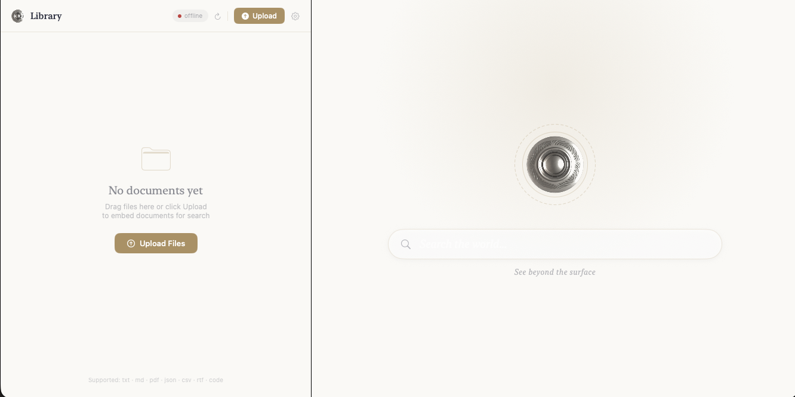

# SeerMini

<p align="center">
  <a href="Demo/README.md">
    
  </a>
</p>

A stripped-down Swift-on-Server vector search engine component of Seer. Two routes, full stack: document registry, HNSW proximity graph, Product Quantization, WAL persistence, and Mistral embeddings.

MLX embedding support can easily be added in the `EmbeddingModelProvider` for on-device support. 

## Prerequisites

- Swift 5.10+ / Xcode 15+
- macOS 14+
- A [Mistral API key](https://console.mistral.ai/) or Apple Silicon

## Setup

```bash
export MISTRAL_API_KEY="your-key-here"
```

### MLX (on-device, Apple Silicon)

No API key needed. Download the model from the Hub before starting the server:

```bash
pip install huggingface_hub
hf auth login
hf download mlx-community/Qwen3-Embedding-0.6B-4bit-DWQ
```

The model is cached in `~/.cache/huggingface/hub/` and loaded on first request when `--use-mlx` is set. Subsequent starts reuse the cached weights with no download.

## Build & Run

```bash
cd /path/to/SeerMini
swift build -c release

# Mistral API (default)
.build/release/seer-mini --host 127.0.0.1 --port 8080

# On-device MLX (Apple Silicon)
.build/release/seer-mini --host 127.0.0.1 --port 8080 --use-mlx
.build/release/seer-mini --host 127.0.0.1 --port 8080 --use-mlx --mlx-model mlx-community/Qwen3-Embedding-0.6B-4bit-DWQ
```

Or during development:

```bash
swift run seer-mini --host 127.0.0.1 --port 8080
swift run seer-mini --host 127.0.0.1 --port 8080 --use-mlx
```

Check health:

```bash
curl http://127.0.0.1:8080/health
# {"status":"ok"}
```

---

## Core Services

### Registry

The `SeerRegistry` is the ownership and access-control layer. Every document must be registered to an owner before it can be searched.

| Concept | What it is |
|---|---|
| `ownerId` | Arbitrary string identifying the caller — passed in the request body (no auth middleware) |
| `DocumentID` | SHA-256 hash of the document's text chunks — content-addressed, collision-safe |
| `GroupID` | Owner-defined namespace that bundles documents together |
| `Access` | `.available` (globally searchable) or `.restricted` (owner-only, default) |

Documents are **deduplicated by content**: if two owners embed the same text, only one copy of the vectors is stored. The second owner is linked to the existing document automatically.

### Groups

Groups are logical collections owned by a single owner. Documents inside a group can have shared metadata (tags, description) that surfaces in search. Access on the group propagates to all documents inside it.

```json
"group": {
  "id": "my-group",
  "label": "My Knowledge Base",
  "owner_id": "alice",
  "documents": [],
  "access": "restricted",
  "metadata": {
    "description": "Internal docs",
    "tags": ["swift", "server"]
  }
}
```

### Partition Table & HNSW

Each document is split into text chunks (partitions). Each partition gets a 1024-dimensional Mistral embedding. Partitions are stored in:

- **PartitionIndex** — per-document index holding PQ-compressed vectors, a tags embedding, and learned codebooks.
- **PartitionTable** — multi-shard container that holds all document indices plus the HNSW proximity graph shards.
- **HNSWShard / HNSWGraph** — approximate nearest-neighbor graph; each shard handles a slice of the embedding space.
- **HNSWVectorStore** — memory-mapped binary file for raw float32 embeddings.

### Product Quantization (PQ)

Embeddings are compressed at index time via `PartitionQuantizer`. Each 1024-float vector is encoded into a compact `UInt16` code using learned k-means codebooks. Search uses Asymmetric Distance Computation (ADC) against pre-computed distance tables — fast enough to scan millions of partitions without loading full vectors.

### WAL Persistence

Two write-ahead logs survive restarts:

- **HNSWTopologyWAL** — append-only log of graph topology mutations (node insertions, edge updates).
- **RegistryWAL** — append-only log of registry mutations (register, linkOwner, updateAccess).

On startup, both logs are replayed in order before any requests are served.

### EmbeddingModelProvider

Two backends, selected at startup with `--use-mlx`:

| Backend | Flag | Model | Dimensions |
|---|---|---|---|
| Mistral API (default) | _(none)_ | `mistral-embed` | 1024 |
| On-device MLX | `--use-mlx` | `Qwen3-Embedding-0.6B-4bit-DWQ` (default) | 1024 |

**Mistral** — Actor-based API client. Max 3 concurrent slots with a priority queue; identical texts within a batch are coalesced into one request. Requires `MISTRAL_API_KEY`.

**MLX** — Runs entirely on-device via Apple Silicon GPU. Model is loaded from the Hugging Face Hub cache on first request. No API key or network access needed after download. Use `--mlx-model` to specify a different Hub model ID.

---

## Routes

### `POST /v1/batch/embeddings`

Indexes one or more documents. Each document's text is embedded, compressed, and added to the HNSW graph. The response is returned immediately — indexing happens in a detached background task.

**Request**

```json
{
  "inputs": [
    "A string, or...",
    ["array", "of", "strings"]
  ],
  "sanitize": true,
  "seer": {
    "owner_id": "alice",
    "group": {
      "id": "my-group",
      "label": "My Knowledge Base",
      "owner_id": "alice",
      "documents": []
    }
  },
  "tags": [
    ["optional", "per-document", "tags"],
    ["second-doc-tags"]
  ],
  "update": null,
  "media_type": "text"
}
```

| Field | Type | Required | Description |
|---|---|---|---|
| `inputs` | `[String \| [String]]` | Yes | One entry per document. String or array of strings. |
| `seer.owner_id` | String | Yes | Identity of the caller. Lowercased on receipt. |
| `seer.group` | Group | No | Assigns all documents in this batch to a named group. |
| `sanitize` | Bool | No | When `true`, passes each input through `TextChunker` before embedding (paragraph/sentence-aware splitting). Default: `false`. |
| `tags` | `[[String]]` | No | Per-document tag hints. Outer index aligns 1:1 with `inputs`. If empty, tags are auto-generated from the text. |
| `update` | SeerUpdate | No | Replace semantics for an existing document. |
| `media_type` | String | No | `"text"` (default) or `"image"`. |

**Response**

```json
{
  "object": "list",
  "model": "mistral-embed",
  "usage": { "prompt_tokens": 312, "total_tokens": 312 },
  "success": true,
  "user": { ... }
}
```

`success` is `true` when every input in the batch was either indexed, linked, or skipped (already exists for this owner). `usage.prompt_tokens` counts only the embeddings that were actually generated.

---

### `POST /v1/search`

Searches indexed documents for the closest matching partitions to a query string.

**Request**

```json
{
  "query": "how does product quantization work?",
  "seer": {
    "owner_id": "alice",
    "group": { "id": "my-group", "label": "...", "owner_id": "alice", "documents": [] },
    "scope": "personal",
    "aggregate": false
  }
}
```

| Field | Type | Required | Description |
|---|---|---|---|
| `query` | String | Yes | Natural language query. Embedded at search time. |
| `seer.owner_id` | String | Yes | Scopes the search to this owner's documents by default. |
| `seer.scope` | `"personal" \| "global"` | No | `personal` (default): only the owner's documents. `global`: all `.available` documents. |
| `seer.aggregate` | Bool | No | When `true`, also searches any groups the owner has access to. |
| `seer.group` | Group | No | Restricts search to a specific group. |
| `seer.groups` | [Group] | No | Restricts search to a list of groups. |
| `seer.tags` | [String] | No | Tag filter: only documents whose tag embedding is within threshold are considered. |

**Response**

```json
{
  "object": "list",
  "texts": [
    "...most relevant partition text...",
    "...second result..."
  ],
  "references": [
    {
      "document_id": "abc123",
      "partition_id": "def456",
      "distance": 0.12
    }
  ],
  "shard_stats": null
}
```

`texts` and `references` are parallel arrays — `texts[i]` is the content of `references[i]`. `shard_stats` is included when debug-level stats are enabled.

---

## Batch Embeddings Workflow

Here is the complete sequence to index documents and query them.

### Step 1 — Embed your documents

Send one request per batch. Group related documents together for coherent search scoping.

```bash
curl -X POST http://127.0.0.1:8080/v1/batch/embeddings \
  -H "Content-Type: application/json" \
  -d '{
    "inputs": [
      "Swift actors serialize concurrent access by routing all calls through a single executor.",
      "Product quantization compresses high-dimensional vectors into compact integer codes."
    ],
    "sanitize": false,
    "seer": {
      "owner_id": "alice",
      "group": {
        "id": "swift-docs",
        "label": "Swift Documentation",
        "owner_id": "alice",
        "documents": []
      }
    }
  }'
```

### Step 2 — Wait for indexing

The response returns immediately. Indexing is asynchronous. In practice, for small batches this completes within milliseconds. For large batches poll the health endpoint or add a short delay before querying.

### Step 3 — Search

```bash
curl -X POST http://127.0.0.1:8080/v1/search \
  -H "Content-Type: application/json" \
  -d '{
    "query": "how do actors work in Swift?",
    "seer": {
      "owner_id": "alice",
      "group": {
        "id": "swift-docs",
        "label": "Swift Documentation",
        "owner_id": "alice",
        "documents": []
      },
      "scope": "personal"
    }
  }'
```

### Step 4 — Share documents publicly (optional)

Documents are `.restricted` by default — only visible to their owner. To make a document globally searchable, embed it with `"scope": "global"` or set the group's `"access": "available"`.

```json
"seer": {
  "owner_id": "alice",
  "group": {
    "id": "public-docs",
    "label": "Public Documentation",
    "owner_id": "alice",
    "documents": [],
    "access": "available"
  }
}
```

Another owner can then search it with `"scope": "global"`:

```json
"seer": {
  "owner_id": "bob",
  "scope": "global"
}
```

---

## Notes

- **No authentication.** `owner_id` is taken directly from the request body. Use a reverse proxy (nginx, Caddy) with bearer token enforcement if you expose this to the internet.
- **Persistence.** The registry and HNSW topology are persisted via WAL files in the process working directory. Do not delete these while the server is running.
- **Deduplication.** Document IDs are SHA-256 hashes of their content. Submitting the same text twice under a different owner links the second owner to the existing vectors — no re-embedding occurs.
- **Tag auto-generation.** If no `tags` are supplied, `TagGenerator` derives frequency-weighted keywords from the text. These are embedded separately and used as a pre-filter during search to improve precision on large indexes.
